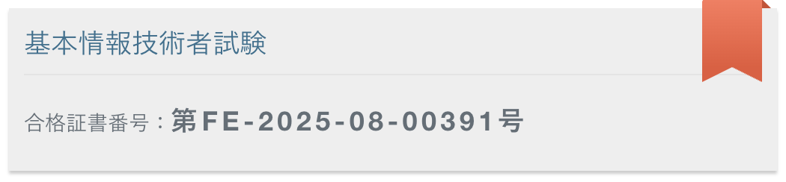
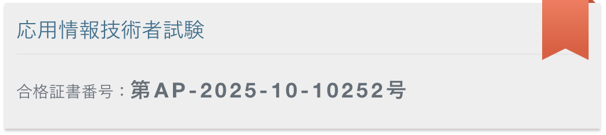

---
<table>
<tr>
  <td align="center">
  
  
  
  </td>
</tr>
</table>

---

## 技術さタック

### バックエンド

### フロントエンド

### インフラ＆クラウドネイティブ

---

## 組織

<table>
<tr>
<td align="center" width="50%">

**[ktcloud-msa](https://github.com/ktcloud-msa)**

KT Cloud — MSA Architecture  
`Kotlin` · `Helm` · `ArgoCD` · `Kubernetes`

</td>
<td align="center" width="50%">

**[12LikelionTeam1](https://github.com/12LikelionTeam1)**

멋쟁이사자처럼 12기 · 하루한글  
`Spring Boot` · `TypeScript` · Hackathon

</td>
</tr>
</table>

---

## 投稿

<table>
<tr>
<td>

**[Qiita @kimyoungho0415](https://qiita.com/kimyoungho0415)**  
Container · Linux · Podman · Kubernetes · Spring Boot  

</td>
<td>

**[Naver Blog](https://blog.naver.com/k4nei)**  
Tech notes & engineering logs

</td>
</tr>
</table>

---

## 証書

<table>
<tr>
<td>

</td>
<td>

</td>
</tr>
</table>
